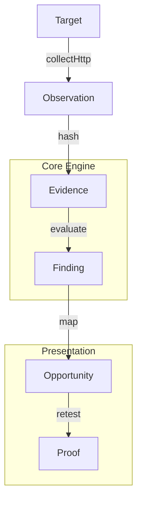

# ARGUS
> Evidence & Opportunity Control Plane

ARGUS is a strict, deterministic intelligence pipeline designed to verify external organizational security posture. Unlike traditional vulnerability scanners that hallucinate findings or output massive volumes of unactionable noise, ARGUS relies exclusively on **cryptographically hashed, reproducible evidence**.

## The ARGUS Doctrine
1. **Observe:** Collect raw network state passively (HTTP headers, DNS records).
2. **Prove:** Irreversibly hash the raw observation into an immutable `Evidence` object.
3. **Decide:** Apply pure, deterministic rules (no AI) to generate a `Finding`.
4. **Fix:** Map findings to clear `Opportunities` for remediation.
5. **Verify:** Execute a discrete Retest run and compare `evd_before` to `evd_after`.

**AI is intentionally excluded from the evidence and decision path.** It is relegated strictly to the presentation and remediation layers, ensuring zero false positives in core analysis.

## Golden Demo (60 Seconds)
ARGUS includes a deterministic, offline demo that proves the Retest lifecycle. 

```bash
# Enable package manager and install dependencies
corepack enable
pnpm install

# Build the workspace
pnpm build

# Run the deterministic demonstration
pnpm demo
```

## Architecture



## Project Structure (pnpm workspace)
- `@argus/schema`: Pure type contracts. No logic.
- `@argus/core`: Deterministic rule engine and assessment logic.
- `@argus/collectors`: Edge adapters (HTTP, DNS) for capturing observations.
- `@argus/console`: CLI Operator UX.
- `@argus/web`: Evidence presentation PWA (Offline-first).

## Security boundaries
- **Public Passive Only:** ARGUS does not generate intrusive traffic.
- **Local-First Processing:** Evidence mapping and rules run locally.
- **No Telemetry:** Zero external analytics or telemetry dependencies.
