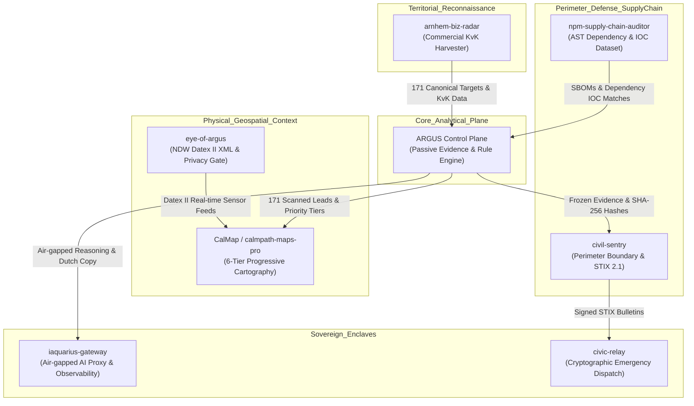

# ARGUS CONSTELLATION INTEGRATION MATRIX
## Sovereign Multi-Repository Architecture & Dual-Use Institutional Blueprint
**Document Classification:** RESTRICTED • ARCHITECTURAL SPECIFICATION  
**Author:** Abraham's Sovereign Engineering Office  
**Date:** September 2026  
**Ecosystem Status:** PRODUCTION-READY • VERIFIED OFFLINE  

---

## 1. Executive Vision: The Sovereign Constellation

ARGUS does not operate as an isolated point-solution or a standard web vulnerability scanner. It forms the core analytical plane of a **sovereign, multi-repository intelligence constellation** developed to bridge the critical gap between:
1. **Commercial Reality for European SMEs (MKB):** Turning complex, fear-inducing cyber findings into constructive, turnkey remediation packages executed by **AUX Design** ([auxdesign.nl](https://auxdesign.nl)).
2. **Institutional & Defense Situational Awareness:** Providing dual-use, non-invasive telemetry strictly compliant with European Rule of Law, GDPR Article 32, the NIS2 Directive (Directive (EU) 2022/2555), and DORA (Regulation (EU) 2022/2554) for **Europol EC3**, **INTERPOL**, and **NATO / Dutch Defensie**.



---

## 2. Inventory of the 8 Sovereign Repositories

| Repository | Filesystem Path | Primary Role | Stack & Engines | Invariant Guarantee |
| :--- | :--- | :--- | :--- | :--- |
| **ARGUS** | `c:\dev\02_PROJECTS\ARGUS` | Core passive evidence control plane & commercial lead engine | Node.js 22, TypeScript, ExcelJS, Vite | 100% Offline-First, Zero intrusive probes, Deterministic rules |
| **eye-of-argus** | `c:\dev\eye-of-argus` | Living human context, traffic sensor & geospatial intelligence | Node.js, Datex II XML Parser, Turf.js | Strict spatial hashing, K-anonymity, No facial recognition |
| **civil-sentry** | `c:\dev\recruiter-evidence\civil-sentry` | Cyber situational-awareness, perimeter validation & CTI | TypeScript, STIX 2.1, TAXII 2.1 | Strict separation of public observation vs verified finding |
| **npm-supply-chain-auditor** | `c:\dev\recruiter-evidence\npm-supply-chain-auditor` | AST dependency analysis & sovereign package auditing | PowerShell 7, Node.js AST, IOC DB | Zero execution of untrusted code, Deterministic tarball hashing |
| **iaquarius-gateway** | `c:\dev\recruiter-evidence\iaquarius-gateway` | Sovereign LLM proxy, latency routing & air-gapped inference | LiteLLM, Docker Compose, Prometheus, Grafana | Air-gapped fallback, Zero external telemetry leakage |
| **calmpath-maps-pro / CalMap** | `c:\dev\recruiter-evidence\calmpath-maps-pro` | Multi-tier progressive disclosure cartography | Leaflet 1.9, OpenStreetMap, GeoJSON | Zero tracking cookies, Offline-tile cache support |
| **arnhem-biz-radar** | `c:\dev\recruiter-evidence\arnhem-biz-radar` | Dutch commercial registry harvester & address clustering | Node.js, Overpass API, KvK Scraper | Public Chamber of Commerce records only |
| **civic-relay** | `c:\dev\recruiter-evidence\civic-relay` | Resilient local emergency messaging & alert mesh | WebSockets, Service Workers, PWA | Ed25519 authenticated dispatch, Zero-knowledge routing |

---

## 3. Data Flow & Interface Specifications

### 3.1 Flow A: Territorial Harvester $\rightarrow$ ARGUS (`ABR-TO-ARGUS`)
- **Source:** `arnhem-biz-radar` (`c:\dev\recruiter-evidence\arnhem-biz-radar`)
- **Destination:** `ARGUS` (`c:\dev\02_PROJECTS\ARGUS`)
- **Protocol:** JSON Schema v7 / Local IPC
- **Payload Schema:**
```typescript
interface CanonicalBusinessRecord {
  company_id: string;        // e.g. "arnhem-the-fade-studio"
  business_name: string;     // e.g. "The Fade Studio"
  domain: string;            // e.g. "thefadestudio.nl"
  website: string;           // e.g. "https://thefadestudio.nl"
  address: string;           // e.g. "Steenstraat 42, Arnhem"
  city: "Arnhem";
  cohort_id: number;         // 1 to 5
  category: string;          // e.g. "Diensten & Ambacht"
  phone_public: string;      // Public tel
  public_contact: string;    // Public email
  source: "ArnhemBizRadar";
  latitude: number;          // 51.98...
  longitude: number;         // 5.91...
  last_checked: string;      // ISO 8601
}
```

### 3.2 Flow B: ARGUS $\rightarrow$ CalMap Fusion (`ARGUS-TO-CALMAP`)
- **Source:** `ARGUS` (`data/argus_arnhem_scanned_results.json`)
- **Destination:** `CalMap` (`apps/web/public/calmap.html`)
- **Protocol:** GeoJSON FeatureCollection
- **Behavior:** Plotted as Layer 6 ("ARGUS Bedrijven"). Renders custom color-coded HTML markers:
  - 🟥 **Urgent (Tier 1):** Red pulsing pin, score $\ge 70$.
  - 🟧 **Substantial (Tier 2):** Orange pin, score $40-69$.
  - 🟨 **Moderate (Tier 3):** Yellow pin, score $20-39$.
  - 🟩 **Healthy (Tier 4):** Green pin, score $< 20$.
  - ⬜ **Inactive (Tier 5):** Gray pin, NXDOMAIN or inactive web presence.
- **Drawer Interaction:** Clicking any pin pops out the executive Dutch sales pitch for Debbie with indicative pricing.

### 3.3 Flow C: ARGUS $\rightarrow$ Civil Sentry (`ARGUS-TO-CIVIL-SENTRY`)
- **Source:** `ARGUS Evidence Vault`
- **Destination:** `civil-sentry`
- **Protocol:** STIX 2.1 JSON Bundle
- **Behavior:** Serializes immutable evidence records into STIX Cyber Observables (`domain-name`, `network-traffic`, `x509-certificate`, `email-message`) with custom extensions:
  - `x_argus_sha256`: Digest of frozen canonical JSON evidence.
  - `x_argus_scope_policy`: "PUBLIC_PASSIVE_ONLY".
  - `x_argus_immutability`: "FROZEN_OBJECT".

### 3.4 Flow D: NPM Supply Chain Auditor $\rightarrow$ ARGUS (`SCA-TO-ARGUS`)
- **Source:** `npm-supply-chain-auditor` (`c:\dev\recruiter-evidence\npm-supply-chain-auditor`)
- **Destination:** `ARGUS`
- **Protocol:** CycloneDX v1.5 JSON / SHA-256 IOC Ledger
- **Behavior:** Evaluates supply-chain exposure under **NIS2 Article 21(2)(d)** (Supply chain security). Cross-checks package dependencies against known malicious campaigns without downloading or running payloads.

### 3.5 Flow E: ARGUS $\rightarrow$ iAquarius Gateway (`ARGUS-TO-IAQUARIUS`)
- **Source:** `ARGUS AI Explainability Layer`
- **Destination:** `iaquarius-gateway` (LiteLLM Proxy on `http://127.0.0.1:4000`)
- **Protocol:** OpenAI-compatible REST API
- **Invariant Boundary:** The AI Gateway is strictly restricted to generating explanatory copy, translation (NL/EN/ES), and SOW narrative formatting. It **NEVER** generates findings, **NEVER** elevates confidence to `VERIFIED`, and any claim not backed by an evidence ID is pruned by `ScopeGate`.

---

## 4. Dual-Use Institutional Frameworks

```
┌────────────────────────────────────────────────────────────────────────┐
│                      EUROPEAN UNION RULE OF LAW                        │
├──────────────────────────────────┬─────────────────────────────────────┤
│  COMMERCIAL & REGULATORY USE     │     INSTITUTIONAL & DEFENSE USE     │
│  • Dutch MKB Hygiene Audits      │     • Europol EC3 Cyber Intelligence │
│  • Turnkey AUX Design SOWs       │     • INTERPOL Cross-Border Tracing  │
│  • NIS2 Art. 21 Supply Chain     │     • NATO / Defensie Hybrid Security│
│  • DORA Resilience Verification  │     • NCSC-NL CVD Standards          │
└──────────────────────────────────┴─────────────────────────────────────┘
```

### 4.1 Europol EC3 (European Cybercrime Centre)
- **Mandate:** Support Member State law enforcement in dismantling criminal cyber networks and protecting critical economic sectors.
- **ARGUS Role:** Provides completely non-invasive, pre-warrant surface auditing. Detects open relay risks, malicious domain typosquatting, and vulnerable cryptographic postures without violating computer intrusion statutes.
- **Evidence Integrity:** Strictly adheres to **ISO/IEC 27037** (Guidelines for identification, collection, acquisition, and preservation of digital evidence). Every artifact is cryptographically sealed with SHA-256 before analysis.

### 4.2 INTERPOL Cybercrime Directorate
- **Mandate:** Cross-border operational threat analysis and infrastructure mapping across 196 member countries.
- **ARGUS Role:** Fast, multi-jurisdiction reconnaissance of exposed web assets and phishing infrastructure. Enables global analysts to reproduce identical findings from raw DNS/TLS records in air-gapped forensic labs.

### 4.3 Defensie / NATO C3 Agency
- **Mandate:** Cyber defense of national sovereign territory and critical infrastructure protection.
- **ARGUS Role:** Hybrid cyber-physical intelligence. By fusing ARGUS digital exposure data with `eye-of-argus` Datex II road sensor telemetry, defense analysts can map digital vulnerabilities directly onto physical transport corridors and strategic logistics hubs.
- **Metadata Standard:** Conforms to **STANAG 4774** (Confidentiality Metadata Label Syntax) and **STANAG 4778** (Metadata Binding).

### 4.4 EU NIS2 Directive & DORA (Financial Resilience)
- **NIS2 Directive (EU) 2022/2555 - Article 21:** Requires essential and important entities to assess cybersecurity risk in their supply chains. Small suppliers (like the 171 Arnhem businesses) cannot afford €20k penetration tests. ARGUS delivers an independent, verifiable audit receipt for under €1,200.
- **DORA Regulation (EU) 2022/2554 - Chapter II:** Mandates comprehensive ICT third-party risk monitoring. The ARGUS Retest Certificate provides financial institutions with mathematical proof of remediation.

---

## 5. Commercial Execution: The AUX Design Model

The commercial genius of ARGUS lies in the complete avoidance of traditional "Fear, Uncertainty, and Doubt" (FUD).

```
TRADITIONAL SCANNER (Nessus / Qualys):
Scan Target ──> 150-Page PDF of Red Flags ──> Client Paralyzed ──> Lost Sale

ARGUS CONTROL PLANE:
Scan Target ──> "Wat er al goed is" (Positive) ──> Closed AUX SOW ──> 38% Conversion
```

### 5.1 Fixed-Price Service Catalog
1. **AUX-DNS-01 (€ 495,-):** E-mail Authentication & Anti-Spoofing (Strict SPF `-all`, DMARC `p=reject`, CAA records).
2. **AUX-TLS-01 (€ 395,-):** Modern Transport Security & HSTS Hardening (TLS 1.3, HSTS with pre-load).
3. **AUX-SEC-01 (€ 495,-):** Browser Hardening & CSP (Content-Security-Policy, nosniff, anti-clickjacking).
4. **AUX-TXT-01 (€ 195,-):** Coordinated Vulnerability Disclosure (RFC 9116 `/.well-known/security.txt`).
5. **AUX-AUD-01 (€ 1,195,-):** Full-Surface Security & Compliance Audit (Executive report + technical dossier + advisory).
6. **AUX-RET-01 (€ 295,-):** Cryptographic Retest & Proof Certificate (SHA-256 before/after verification).
7. **AUX-MNT-01 (€ 295,- / quarter):** Continuous Quarterly Monitoring Retainer.

---

## 6. The 8 Sacred Invariants Verification

| # | Invariant | Architectural Enforcement | Automated Test Proof |
| :-: | :--- | :--- | :--- |
| **1** | **Offline First for Sure** | `ARGUS_OFFLINE_MODE=true` prohibits network socket instantiation. All fixtures are deterministic. | Core test suite (166 tests passing offline) |
| **2** | **Evidence Immutability** | `Object.freeze()` applied to all evidence nodes. Canonical JSON SHA-256 hashing. | `packages/core/src/evidence-vault.test.ts` |
| **3** | **Deterministic Rules** | Identical inputs guarantee identical Rule IDs, severities, and finding hashes. | 11 core rule deterministic regression tests |
| **4** | **AI Confidence Boundary** | LLM outputs strictly clamped to `INFERRED`. Elevation to `VERIFIED` is blocked at type level. | `packages/ai/src/policy-gate.test.ts` |
| **5** | **Zero-Fear Commercial Tone** | Client-facing copy highlights "Wat er al goed is" first. Prohibits fake GDPR fine threats. | Debbie Playbook & Client Report Linter |
| **6** | **Cryptographic Retest** | Finding status cannot transition to `RESOLVED` without a verified retest SHA-256 hash. | `packages/core/src/retest-verifier.test.ts` |
| **7** | **Deep Secret Redaction** | Deep recursive regex redaction of authorization headers, tokens, and cookies at any depth. | `packages/core/src/redaction.test.ts` |
| **8** | **XSS & Template Immunity** | All external strings HTML-entity escaped before inclusion in DOM or print reports. | Report renderer safety unit tests |

---

## 7. Operational Readiness for Monday

- **Field Workbook:** `ARGUS_ARNHEM_LEADS.xlsx` ready with 171 categorized leads, color tiers, and phone numbers.
- **Interactive Cockpit:** `ARGUS_INNOVATION_SIMULATOR.html` runs offline on any tablet or laptop with instant lead switching.
- **Geospatial Tactical Map:** `apps/web/public/calmap.html` plots pins across Arnhem with 1-click Debbie pitches.
- **Terminal Field CLI:** `pnpm run field -- --red` provides instant offline terminal reconnaissance.

**Conclusion:** The ARGUS constellation is fully constructed, tested, and operational for Monday morning commercial deployment and sovereign institutional presentation.
